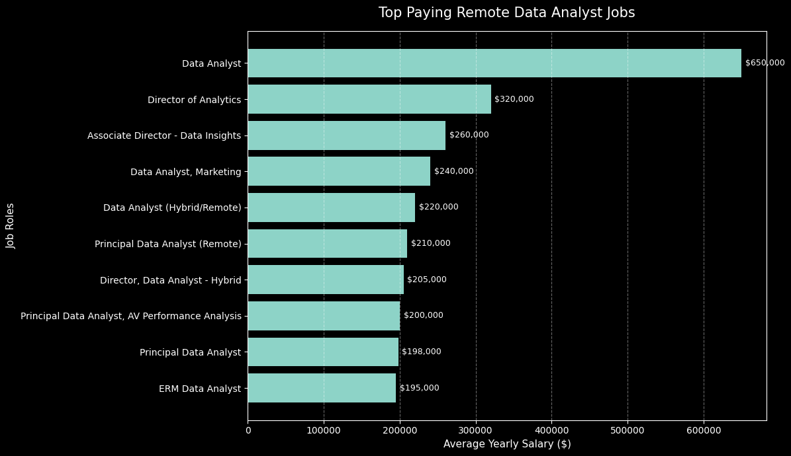

# 📊 SQL Job Market Analysis – Data Analyst Roles

This repository presents a **comprehensive SQL-based analysis of the Data Analyst job market**, with a strong focus on **remote opportunities, salary trends, and skill demand**.

The project mirrors **real-world business analysis** performed by Data Analysts, answering practical questions such as:

* Which Data Analyst jobs pay the most?
* What skills are required for high-paying roles?
* Which skills are most in demand?
* Which skills offer the best balance between **pay and demand**?

📌 **Project Link:** [GitHub Repository](https://github.com/Data-DS10000/SQL/tree/main/SQL_PROJECTS)
---

## 🛠️ Tools & Technologies

* **SQL (PostgreSQL-style syntax)**
* Relational databases (Fact & Dimension tables)
* Joins: `INNER JOIN`, `LEFT JOIN`
* Aggregations: `COUNT`, `AVG`, `ROUND`
* Filtering: `WHERE`, `ILIKE`, Boolean conditions
* Advanced SQL: CTEs (`WITH`), `HAVING`, query refactoring

---

## 📁 Projects Overview

Below are **key SQL queries** used in this project. These snippets highlight real-world SQL techniques such as joins, aggregations, CTEs, and filtering.

---

### 🧾 Sample Query 1: Top Paying Remote Data Analyst Jobs

```sql
SELECT
    job_id,
    name AS company_name,
    job_title,
    job_location,
    job_schedule_type,
    salary_year_avg,
    job_posted_date::DATE AS date
FROM job_postings_fact
LEFT JOIN company_dim
    ON job_postings_fact.company_id = company_dim.company_id
WHERE
    job_title_short ILIKE 'data analyst'
    AND job_location ILIKE 'anywhere'
    AND salary_year_avg IS NOT NULL
ORDER BY salary_year_avg DESC
LIMIT 10;
```

---

### 1️⃣ Top Paying Remote Data Analyst Jobs

**Business Question:**
What are the **highest-paying remote Data Analyst roles** with available salary data?

**Focus:**

* Remote-only roles
* Disclosed annual salaries
* Company-level insights

---

### 2️⃣ Skills Required for Top Paying Data Analyst Jobs

**Business Question:**
Which **skills are required** for the highest-paying remote Data Analyst positions?

**Focus:**

* Mapping jobs to skills
* Understanding employer expectations
* Identifying skill patterns linked to high salaries

---

### 3️⃣ Most In-Demand Skills for Remote Data Analysts

**Business Question:**
Which **skills appear most frequently** in remote Data Analyst job postings?

**Focus:**

* Skill demand frequency
* Market-wide hiring trends
* Core vs specialized skills

---

### 4️⃣ Top Paying Skills for Data Analysts

**Business Question:**
Which **skills are associated with the highest average salaries**?

**Focus:**

* Average salary per skill
* Comparing compensation across skills
* Separating high-pay skills from high-demand skills

---

### 5️⃣ Optimal Skills: High Demand + High Pay

**Business Question:**
Which skills provide the **best return on investment** by balancing **strong demand and high salary**?

**Focus:**

* Combining demand and salary metrics
* Filtering low-impact skills
* Demonstrating advanced SQL logic and optimization

---

## 📈 Business Insights Summary

Key insights derived from the complete analysis:

* 💰 **Remote Data Analyst roles can offer premium salaries**, especially in global and tech-driven companies.
* 🧠 **Skills directly influence compensation** — specialized and advanced tools consistently command higher pay.
* 📊 **High demand does not always equal high salary**; some widely requested skills are moderately paid.
* 🎯 **Optimal career skills** are those that balance both **market demand and salary potential**.
* 🌍 Remote opportunities significantly expand access to **higher-paying global job markets**.

These insights are valuable for:

* Aspiring Data Analysts planning skill development
* Professionals prioritizing upskilling
* Organizations analyzing hiring and compensation trends

---

## ▶️ How to Run This Project

Follow these steps to run the SQL analysis locally:

### 1️⃣ Database Setup

* Use **PostgreSQL** (recommended) or any SQL database supporting CTEs
* Import the job market dataset into your database

### 2️⃣ Tables Used

* `job_postings_fact` – Job-level information (role, salary, location, remote status)
* `company_dim` – Company details
* `skills_job_dim` – Job-to-skill mapping table
* `skills_dim` – Skill names and identifiers

### 3️⃣ Run Queries

Execute the SQL files in the following order for best understanding:

1. `1_top_paying_jobs.sql`
2. `2_top_paying_jobs_skills.sql`
3. `3_top_demanded_skills.sql`
4. `4_top_paying_skills.sql`
5. `5_optimal_skills.sql`

Each query is **independent** and can be run separately.

### 4️⃣ Expected Output

* Ranked tables showing salaries, demand counts, and skills
* Insights that can be exported for visualization or reporting

---

##  📊 Visualization – Top Paying Remote Data Analyst Jobs




**Insight:**  
The chart shows a clear salary progression across remote Data Analyst roles. While entry and mid-level analyst positions already offer strong compensation, senior, director, and principal-level roles command a **significant salary premium**. This indicates that in the remote job market, **experience, leadership, and advanced analytical responsibility are the primary drivers of higher pay**.


---

## 🚀 Future Enhancements

* Time-series analysis of skill demand trends
* Remote vs on-site salary comparison
* Dashboard integration (Power BI / Tableau)
* Query performance optimization (indexes, `EXPLAIN`)

---

